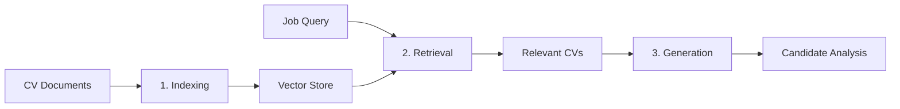
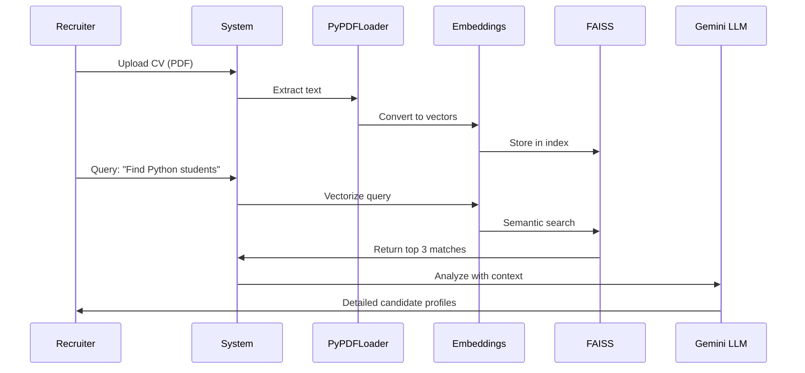

## What is RAG?

**Retrieval-Augmented Generation (RAG)** is an AI architecture pattern that combines the power of information retrieval with large language model (LLM) generation. Instead of relying solely on the LLM's training data, RAG retrieves relevant context from external documents and uses it to generate more accurate, grounded responses.

<Note>
Think of RAG as giving an AI assistant a filing cabinet of documents it can search through before answering questions, rather than relying purely on memory.
</Note>

## The Three Pillars of RAG

The RAG Recruitment Assistant is built on three core operations:



### 1. Indexing: Converting Documents to Vectors

The system transforms PDF CVs into searchable vector representations:

```python
# Source: notebook/Talent_Scout_3000x.ipynb
from langchain_community.document_loaders import PyPDFLoader
from langchain_community.vectorstores import FAISS
from langchain_huggingface import HuggingFaceEmbeddings

# Load CV as document
loader = PyPDFLoader(ruta_archivo)
docs = loader.load()

# Create embeddings and vector store
embeddings = HuggingFaceEmbeddings()
vectorstore = FAISS.from_documents(docs, embeddings)
```

Each CV is:
1. **Loaded** from PDF format
2. **Chunked** into manageable text segments
3. **Embedded** into high-dimensional vectors (384 dimensions using HuggingFace)
4. **Indexed** in FAISS for fast similarity search

### 2. Retrieval: Finding Relevant Candidates

When a recruiter asks a question, the system:

```python
# Create retriever from vector store
retriever = vectorstore.as_retriever()

# Example query
pregunta = "¿Qué proyectos destacados tiene este estudiante?"
relevant_docs = retriever.invoke(pregunta)
```

- Converts the query into a vector
- Performs **semantic similarity search** in FAISS
- Returns the most relevant CV sections

### 3. Generation: LLM-Powered Analysis

The retrieved context is fed to Gemini 1.5 Flash for intelligent analysis:

```python
from langchain_google_genai import ChatGoogleGenerativeAI
from langchain_core.prompts import ChatPromptTemplate

# Initialize Gemini
llm = ChatGoogleGenerativeAI(
    model="gemini-1.5-flash",
    temperature=0  # Deterministic responses
)

# Define analysis prompt
template = """
Eres un Mentor de Carrera Tecnológica.
Analiza el perfil basándote en el siguiente contexto:
{context}

Pregunta: {question}
"""
prompt = ChatPromptTemplate.from_template(template)
```

---

## Technology Stack

The RAG Recruitment Assistant leverages a modern, production-ready stack:

<CardGroup cols={2}>
  <Card title="LangChain" icon="link">
    Orchestration framework connecting all components
  </Card>
  <Card title="FAISS" icon="magnifying-glass">
    Facebook AI Similarity Search for vector operations
  </Card>
  <Card title="Gemini 1.5 Flash" icon="sparkles">
    Google's LLM for generation and analysis
  </Card>
  <Card title="HuggingFace" icon="face-smile">
    Embeddings using sentence-transformers
  </Card>
</CardGroup>

### Why This Stack?

| Component | Purpose | Key Benefit |
|-----------|---------|-------------|
| **LangChain** | RAG orchestration | Pre-built abstractions for document loaders, vector stores, and chains |
| **FAISS** | Vector search engine | Extremely fast similarity search (handles millions of vectors) |
| **Gemini 1.5 Flash** | LLM generation | Fast, cost-effective, with strong reasoning capabilities |
| **HuggingFace Embeddings** | Text vectorization | Open-source, multilingual support, runs locally |

---

## Architecture Flow: CV Analysis Pipeline

Here's how a complete candidate evaluation flows through the system:

<Steps>
  <Step title="CV Upload">
    Recruiter uploads a student's PDF CV to the system
  </Step>
  <Step title="Document Processing">
    PyPDFLoader extracts text content from the PDF
    ```python
    loader = PyPDFLoader("CV_Estudiante_4_Fernanda_Paredes.pdf")
    docs = loader.load()
    ```
  </Step>
  <Step title="Vectorization">
    HuggingFace embeddings convert text into 384-dimensional vectors
  </Step>
  <Step title="Indexing">
    FAISS stores vectors for fast retrieval
  </Step>
  <Step title="Query Processing">
    Recruiter asks: "What are this student's key technical projects?"
  </Step>
  <Step title="Semantic Retrieval">
    FAISS finds the most relevant CV sections based on vector similarity
  </Step>
  <Step title="LLM Analysis">
    Gemini analyzes retrieved context and generates structured insights:
    - Academic projects
    - Tech stack
    - Hiring potential
  </Step>
  <Step title="Response Delivery">
    System returns actionable candidate assessment
  </Step>
</Steps>

---

## RAG Chain: The Complete Pipeline

LangChain's `RunnablePassthrough` creates an elegant, composable pipeline:

```python
from langchain_core.runnables import RunnablePassthrough
from langchain_core.output_parsers import StrOutputParser

# Build the RAG chain
chain = (
    {"context": retriever, "question": RunnablePassthrough()}
    | prompt
    | llm
    | StrOutputParser()
)

# Execute with a single invocation
respuesta = chain.invoke(
    "¿Qué stack tecnológico domina este estudiante?"
)
```

### Chain Breakdown

<Accordion title="Step 1: Input Preparation">
  ```python
  {"context": retriever, "question": RunnablePassthrough()}
  ```
  - `retriever`: Automatically fetches relevant CV sections
  - `RunnablePassthrough()`: Forwards the question unchanged
</Accordion>

<Accordion title="Step 2: Prompt Formatting">
  ```python
  | prompt
  ```
  Injects context and question into the template
</Accordion>

<Accordion title="Step 3: LLM Generation">
  ```python
  | llm
  ```
  Gemini processes the prompt and generates analysis
</Accordion>

<Accordion title="Step 4: Output Parsing">
  ```python
  | StrOutputParser()
  ```
  Extracts clean string output from LLM response
</Accordion>

---

## From CV Input to Candidate Recommendation

The complete architectural flow in production:



---

## Key Advantages of RAG Architecture

<AccordionGroup>
  <Accordion title="No Retraining Required">
    Update the knowledge base by simply adding new CVs to the vector store. No need to retrain the LLM.
  </Accordion>
  
  <Accordion title="Transparent Decision-Making">
    Every recommendation is grounded in specific CV sections that can be traced back and audited.
  </Accordion>
  
  <Accordion title="Scalable to Thousands of CVs">
    FAISS can efficiently handle millions of vectors with sub-second query times.
  </Accordion>
  
  <Accordion title="Domain-Specific Context">
    The LLM focuses on recruitment-specific analysis, not general knowledge.
  </Accordion>
</AccordionGroup>

---

## Real Implementation Example

Here's the actual code that powers the "Interrogating a CV" feature:

```python
# Source: notebook/Talent_Scout_3000x.ipynb (Cell 3)
import random
import os
from langchain_community.document_loaders import PyPDFLoader
from langchain_community.vectorstores import FAISS
from langchain_core.prompts import ChatPromptTemplate
from langchain_core.output_parsers import StrOutputParser
from langchain_core.runnables import RunnablePassthrough

# 1. SELECT A RANDOM CV
carpeta_fuente = "cvs_estudiantes_final"
archivos_disponibles = os.listdir(carpeta_fuente)
archivo_elegido = random.choice(archivos_disponibles)
ruta_archivo = f"{carpeta_fuente}/{archivo_elegido}"

print(f"📂 Selected: '{archivo_elegido}'")

# 2. LOAD AND VECTORIZE
loader = PyPDFLoader(ruta_archivo)
docs = loader.load()
vectorstore = FAISS.from_documents(docs, embeddings)
retriever = vectorstore.as_retriever()

# 3. DEFINE PROMPT
template = """
You are a Career Mentor and employability expert.
Analyze this student's profile based ONLY on this context:
{context}

Question: {question}
"""
prompt = ChatPromptTemplate.from_template(template)

# 4. BUILD RAG CHAIN
chain = (
    {"context": retriever, "question": RunnablePassthrough()}
    | prompt
    | llm
    | StrOutputParser()
)

# 5. EXECUTE QUERY
pregunta = "What projects and tech stack does this student have?"
respuesta = chain.invoke(pregunta)

print(f"🤖 ANALYSIS:\n{respuesta}")
```

<Note>
**Real Output**: The system successfully analyzed Fernanda Paredes' CV, identifying her:
- **First place in a university Hackathon** (app de reciclaje)
- **Tech stack**: Python, PowerBI, Java, Spring Boot
- **Profile type**: Data Analyst Trainee with strong fullstack foundation
</Note>

---

## Next Steps

<CardGroup cols={2}>
  <Card title="Reverse Matching" icon="rotate" href="/concepts/reverse-matching">
    Learn how this system prioritizes potential over experience
  </Card>
  <Card title="Vector Search Deep Dive" icon="chart-network" href="/concepts/vector-search">
    Explore FAISS and semantic similarity in detail
  </Card>
</CardGroup>