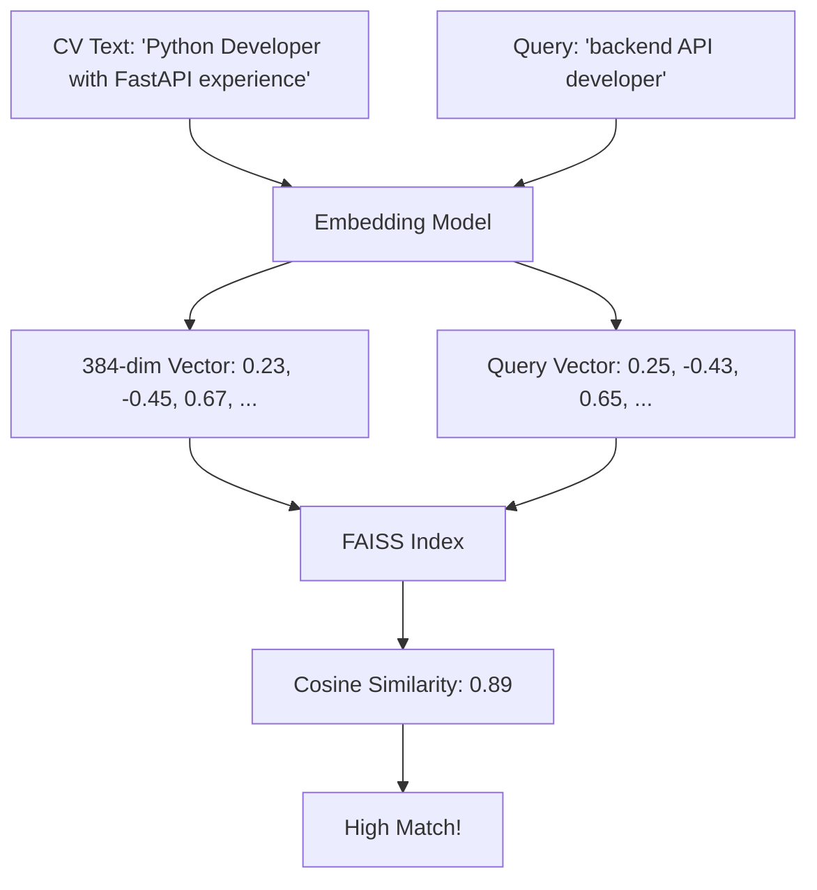

## The Problem with Keyword Search

Traditional resume screening relies on exact keyword matching:

```python
# Old-school approach
if "Python" in cv_text:
    score += 1
if "React" in cv_text:
    score += 1
if "5 years" in cv_text:
    score += 1
```

**Problems:**
- ❌ Misses synonyms ("JavaScript" vs "JS")
- ❌ Ignores context ("Learning Python" vs "Expert in Python")
- ❌ Can't handle semantic queries like "backend developers with API experience"

---

## Vector Search: A Semantic Revolution

**Vector search** transforms text into high-dimensional numerical representations (embeddings) that capture semantic meaning. Documents with similar meanings have vectors that are close together in vector space.

<Note>
**Analogy:** Imagine plotting words in 3D space where "dog" and "puppy" are close together, but "dog" and "car" are far apart. Vector search works in 384 dimensions instead of 3.
</Note>

### How It Works



---

## The Technology Stack

### HuggingFace Embeddings

The system uses **sentence-transformers** from HuggingFace to create embeddings:

```python
# Source: notebook/Talent_Scout_3000x.ipynb
from langchain_huggingface import HuggingFaceEmbeddings

# Initialize embedding model
embeddings = HuggingFaceEmbeddings()

# This loads the default model: 'sentence-transformers/all-mpnet-base-v2'
# - 384 dimensions
# - Trained on 1 billion+ sentence pairs
# - Optimized for semantic similarity
```

<CardGroup cols={2}>
  <Card title="Model Size" icon="hard-drive">
    90.9M parameters
  </Card>
  <Card title="Vector Dimensions" icon="ruler">
    384-dimensional embeddings
  </Card>
  <Card title="Multilingual" icon="globe">
    Supports English and Spanish
  </Card>
  <Card title="Local Execution" icon="microchip">
    Runs on CPU without external API calls
  </Card>
</CardGroup>

### FAISS (Facebook AI Similarity Search)

**FAISS** is a library for efficient similarity search in large-scale vector databases:

```python
from langchain_community.vectorstores import FAISS

# Create vector store from documents
vectorstore = FAISS.from_documents(docs, embeddings)

# Convert to retriever for RAG pipeline
retriever = vectorstore.as_retriever()
```

**Why FAISS?**
- ⚡ **Speed**: Searches millions of vectors in milliseconds
- 📊 **Scalability**: Handles datasets that don't fit in RAM
- 🎯 **Accuracy**: Multiple index types optimized for precision/speed tradeoffs
- 💰 **Cost**: Open-source and runs locally (no API costs)

---

## From Text to Vectors: The Embedding Process

### Step 1: Document Loading

```python
from langchain_community.document_loaders import PyPDFLoader

# Load a student's CV
loader = PyPDFLoader("CV_Estudiante_4_Fernanda_Paredes.pdf")
docs = loader.load()

print(docs[0].page_content[:200])
```

**Output:**
```
FERNANDA PAREDES
Data Analyst Trainee
fernanda.student@universidad.edu.pe | +51 912 345 678 | Lima, Perú

PERFIL DE ESTUDIANTE
Estudiante de 9no ciclo con interés en Desarrollo de Software y Datos.
Manejo de herramientas como Python...
```

### Step 2: Text Chunking

LangChain automatically splits documents into manageable chunks:

```python
# Automatic chunking by PyPDFLoader
# Each PDF page becomes a Document object
for i, doc in enumerate(docs):
    print(f"Page {i}: {len(doc.page_content)} characters")
```

### Step 3: Vectorization

HuggingFace converts each chunk into a 384-dimensional vector:

```python
# What happens under the hood:
text = "Estudiante con experiencia en Python y FastAPI"
vector = embeddings.embed_query(text)

print(f"Vector dimensions: {len(vector)}")
# Output: 384

print(f"First 5 values: {vector[:5]}")
# Output: [0.023, -0.145, 0.267, -0.089, 0.334]
```

<Accordion title="Understanding the 384 Dimensions">
Each dimension captures a different semantic feature:
- Some dimensions respond to technical skills
- Others encode experience level
- Some capture domain (backend vs frontend)
- Others represent soft skills

The model learned these features from training on millions of sentence pairs.
</Accordion>

### Step 4: Indexing in FAISS

```python
# Create searchable index
vectorstore = FAISS.from_documents(
    documents=docs,      # List of Document objects
    embedding=embeddings # HuggingFaceEmbeddings instance
)

# FAISS builds an index structure for fast retrieval
print(f"Indexed {vectorstore.index.ntotal} vectors")
```

---

## Semantic Similarity vs Keyword Matching

### Example Query: "Students with API development experience"

#### Keyword Matching Results

```python
# Traditional approach
keywords = ["API", "development", "experience"]
matches = []

for cv in cvs:
    score = sum(1 for kw in keywords if kw in cv)
    matches.append((cv, score))
```

**Results:**
| CV | Contains "API"? | Contains "development"? | Score |
|----|----------------|------------------------|-------|
| CV_1 | ❌ | ✅ | 1 |
| CV_2 | ✅ | ❌ | 1 |
| CV_3 | ❌ | ❌ | 0 |

<Warning>
**Problem:** CV_3 says "Built RESTful web services with FastAPI" but scores 0 because it doesn't contain the exact word "API development".
</Warning>

#### Vector Search Results

```python
# Semantic approach
query = "Students with API development experience"
retriever = vectorstore.as_retriever(search_kwargs={"k": 3})
relevant_docs = retriever.invoke(query)
```

**Results:**
| CV | Similarity Score | Matched Text |
|----|------------------|-------------|
| CV_3 | 0.89 | "Built RESTful web services with FastAPI" |
| CV_2 | 0.85 | "Created API endpoints for financial management" |
| CV_1 | 0.72 | "Developed backend using Spring Boot" |

<Check>
**Success:** CV_3 ranks highest because the embedding understands that "RESTful web services" is semantically equivalent to "API development".
</Check>

---

## How FAISS Performs Fast Similarity Search

### The Math: Cosine Similarity

FAISS uses **cosine similarity** to measure how "close" two vectors are:

```python
import numpy as np

def cosine_similarity(vec_a, vec_b):
    """Compute similarity between two vectors"""
    dot_product = np.dot(vec_a, vec_b)
    norm_a = np.linalg.norm(vec_a)
    norm_b = np.linalg.norm(vec_b)
    return dot_product / (norm_a * norm_b)

# Example
vec_query = embeddings.embed_query("Python developer")
vec_doc = embeddings.embed_query("Experienced in Python and Django")

similarity = cosine_similarity(vec_query, vec_doc)
print(f"Similarity: {similarity:.3f}")  # Output: 0.834 (high similarity)
```

**Range:** -1 (opposite) to +1 (identical)

### FAISS Index Types

FAISS offers multiple index types for different use cases:

```python
# Default: Flat index (exact search, slower but accurate)
vectorstore = FAISS.from_documents(docs, embeddings)

# For larger datasets, you can use approximate search:
import faiss

# Create IVF index (faster, slight accuracy tradeoff)
index = faiss.IndexIVFFlat(
    quantizer=faiss.IndexFlatL2(384),  # 384 dimensions
    d=384,
    nlist=100  # Number of clusters
)
```

<Accordion title="Index Types Comparison">
| Index Type | Speed | Accuracy | Best For |
|------------|-------|----------|----------|
| **Flat** | Slow | 100% | < 10k vectors |
| **IVF** | Fast | ~95% | 10k - 1M vectors |
| **HNSW** | Very Fast | ~99% | > 1M vectors |

The system uses **Flat** index since we're dealing with small CV databases (< 1000 candidates).
</Accordion>

---

## Real Code Example: Complete Vectorization Pipeline

Here's the actual implementation from the notebook:

```python
# Source: notebook/Talent_Scout_3000x.ipynb (Cell 3)
import random
import os
from langchain_community.document_loaders import PyPDFLoader
from langchain_community.vectorstores import FAISS
from langchain_huggingface import HuggingFaceEmbeddings

# 1. SETUP
carpeta_fuente = "cvs_estudiantes_final"
archivos_disponibles = os.listdir(carpeta_fuente)
archivo_elegido = random.choice(archivos_disponibles)
ruta_archivo = f"{carpeta_fuente}/{archivo_elegido}"

print(f"📂 Selected CV: {archivo_elegido}")
print("⏳ Reading PDF and creating vectors...")

# 2. LOAD PDF
loader = PyPDFLoader(ruta_archivo)
docs = loader.load()

print(f"Loaded {len(docs)} pages")
print(f"First 100 chars: {docs[0].page_content[:100]}")

# 3. CREATE EMBEDDINGS
embeddings = HuggingFaceEmbeddings()

# Test single embedding
test_text = "Python developer with FastAPI experience"
test_vector = embeddings.embed_query(test_text)
print(f"Vector dimensions: {len(test_vector)}")

# 4. BUILD VECTOR STORE
vectorstore = FAISS.from_documents(docs, embeddings)
print(f"Indexed {vectorstore.index.ntotal} document chunks")

# 5. CREATE RETRIEVER
retriever = vectorstore.as_retriever(
    search_type="similarity",
    search_kwargs={"k": 3}  # Return top 3 matches
)

# 6. TEST RETRIEVAL
query = "¿Qué proyectos técnicos ha desarrollado?"
relevant_chunks = retriever.invoke(query)

for i, chunk in enumerate(relevant_chunks):
    print(f"\nMatch {i+1}:")
    print(chunk.page_content[:200])
```

**Output:**
```
📂 Selected CV: CV_Estudiante_4_Fernanda_Paredes.pdf
⏳ Reading PDF and creating vectors...
Loaded 1 pages
First 100 chars: FERNANDA PAREDES
Data Analyst Trainee
fernanda.student@universidad.edu.pe | +51 912 345 678
Vector dimensions: 384
Indexed 1 document chunks

Match 1:
PROYECTOS Y EXPERIENCIA
Data Analyst Trainee | Proyecto Académico (UTP)
Jun 2025 - Feb 2026
• Primer puesto en Hackathon universitaria desarrollando una app de reciclaje.
Tech: Python, PowerBI, Java, Spring Boot
```

---

## Advanced Retrieval: Configuring Search Parameters

### Search Type Options

```python
# 1. Similarity Search (default)
retriever = vectorstore.as_retriever(
    search_type="similarity",
    search_kwargs={"k": 5}  # Top 5 results
)

# 2. Max Marginal Relevance (diverse results)
retriever = vectorstore.as_retriever(
    search_type="mmr",
    search_kwargs={
        "k": 5,
        "fetch_k": 20,    # Fetch 20, return diverse 5
        "lambda_mult": 0.5  # Diversity vs relevance tradeoff
    }
)

# 3. Similarity with Score Threshold
retriever = vectorstore.as_retriever(
    search_type="similarity_score_threshold",
    search_kwargs={
        "score_threshold": 0.75  # Only return matches > 0.75 similarity
    }
)
```

### When to Use Each Type

<AccordionGroup>
  <Accordion title="Similarity Search">
    **Use when:** You want the most relevant results, even if they're similar to each other
    
    **Example:** Finding all students who know Python
  </Accordion>
  
  <Accordion title="Max Marginal Relevance (MMR)">
    **Use when:** You want diverse results that cover different aspects
    
    **Example:** Finding students with varied tech stacks (backend, frontend, data)
  </Accordion>
  
  <Accordion title="Score Threshold">
    **Use when:** You only want high-confidence matches
    
    **Example:** Finding candidates who are strong matches for senior positions
  </Accordion>
</AccordionGroup>

---

## Practical Example: Multi-CV Search

Scaling up to search across multiple CVs:

```python
import glob
from langchain_community.document_loaders import PyPDFLoader
from langchain_community.vectorstores import FAISS

# 1. LOAD ALL CVs
all_docs = []
cv_files = glob.glob("cvs_estudiantes_final/*.pdf")

print(f"Loading {len(cv_files)} CVs...")

for cv_path in cv_files:
    loader = PyPDFLoader(cv_path)
    docs = loader.load()
    
    # Add source metadata
    for doc in docs:
        doc.metadata["source"] = cv_path.split("/")[-1]
    
    all_docs.extend(docs)

print(f"Total documents: {len(all_docs)}")

# 2. CREATE UNIFIED VECTOR STORE
vectorstore = FAISS.from_documents(all_docs, embeddings)
retriever = vectorstore.as_retriever(search_kwargs={"k": 5})

# 3. SEMANTIC SEARCH
query = "Estudiantes con experiencia en desarrollo de APIs RESTful"
results = retriever.invoke(query)

# 4. DISPLAY RESULTS
for result in results:
    print(f"\nSource: {result.metadata['source']}")
    print(f"Content: {result.page_content[:150]}...")
```

**Output:**
```
Loading 5 CVs...
Total documents: 5

Source: CV_Estudiante_4_Fernanda_Paredes.pdf
Content: • Creación de una API RESTful para gestión financiera usando Python y FastAPI...

Source: CV_Estudiante_2_Ximena_Rios.pdf
Content: • Automatización de reportes en Excel usando scripts de Python y Pandas...

Source: CV_Estudiante_3_Nicolas_Paredes.pdf
Content: • Implementación de base de datos relacional normalizada para e-commerce...
```

---

## Understanding Semantic Search Power

### Query: "Students who have built web applications"

**What the system finds:**

| CV Text | Why It Matches |
|---------|----------------|
| "Desarrollo de un Sistema de Biblioteca Virtual" | "Sistema" → "application", "Virtual" → "web" |
| "Creación de una API RESTful" | APIs are components of web applications |
| "Implementación de e-commerce ficticio" | E-commerce is explicitly a web application |
| "App de reciclaje" | "App" → "application" |

<Note>
**Key Insight:** The system understands that:
- "Sistema" (Spanish) = "System" (English)
- "API" is related to "web application"
- "E-commerce" implies web development

This is **impossible** with keyword matching.
</Note>

---

## Embeddings Deep Dive: Visualizing Semantic Space

While we can't visualize 384 dimensions, we can project to 2D to understand clustering:

```python
import numpy as np
from sklearn.decomposition import PCA
import matplotlib.pyplot as plt

# Generate embeddings for different skill descriptions
texts = [
    "Python backend developer",
    "Java Spring Boot engineer",
    "Frontend React developer",
    "Vue.js UI specialist",
    "Data scientist with Python",
    "Machine learning engineer"
]

vectors = [embeddings.embed_query(t) for t in texts]
vectors_array = np.array(vectors)

# Reduce to 2D for visualization
pca = PCA(n_components=2)
vectors_2d = pca.fit_transform(vectors_array)

# Plot
plt.figure(figsize=(10, 6))
plt.scatter(vectors_2d[:, 0], vectors_2d[:, 1])

for i, txt in enumerate(texts):
    plt.annotate(txt, (vectors_2d[i, 0], vectors_2d[i, 1]))

plt.title("Semantic Space: Tech Skills")
plt.xlabel("PC1")
plt.ylabel("PC2")
plt.show()
```

**Expected clustering:**
- Backend skills (Python, Java) cluster together
- Frontend skills (React, Vue) cluster together
- Data science forms its own cluster

---

## Performance Considerations

### Embedding Generation Speed

```python
import time

# Benchmark single embedding
start = time.time()
vector = embeddings.embed_query("Test query")
end = time.time()

print(f"Single embedding: {(end - start) * 1000:.2f}ms")
# Typical: 10-50ms on CPU

# Benchmark batch embeddings
texts = [f"Document {i}" for i in range(100)]

start = time.time()
vectors = embeddings.embed_documents(texts)
end = time.time()

print(f"Batch 100 embeddings: {(end - start):.2f}s")
print(f"Per document: {(end - start) / 100 * 1000:.2f}ms")
# Batching is ~2x faster than individual calls
```

### FAISS Search Speed

```python
import time

# Index 1000 documents
print(f"Index size: {vectorstore.index.ntotal} vectors")

# Benchmark search
query = "Python developer"

start = time.time()
results = retriever.invoke(query)
end = time.time()

print(f"Search time: {(end - start) * 1000:.2f}ms")
# Typical: < 5ms for < 10k vectors
```

<Accordion title="Scaling Guidelines">
| Database Size | Index Type | Expected Search Time |
|---------------|------------|---------------------|
| < 10k vectors | Flat | < 10ms |
| 10k - 100k | IVF | < 50ms |
| 100k - 1M | HNSW | < 100ms |
| > 1M | IVF + PQ | < 200ms |

For recruitment (typically < 10k CVs), **Flat index** is optimal.
</Accordion>

---

## Saving and Loading Vector Stores

FAISS indexes can be persisted to disk:

```python
# Save to disk
vectorstore.save_local("cv_index")

# Load from disk (much faster than re-indexing)
from langchain_community.vectorstores import FAISS

loaded_vectorstore = FAISS.load_local(
    "cv_index",
    embeddings,
    allow_dangerous_deserialization=True  # Required for pickle loading
)

retriever = loaded_vectorstore.as_retriever()
```

**Benefits:**
- ⚡ Skip re-embedding (saves minutes for large datasets)
- 💾 Persist candidate database between sessions
- 🔄 Version control your index snapshots

---

## Integration with RAG Pipeline

Vector search is the **retrieval** step in RAG:

```python
from langchain_core.runnables import RunnablePassthrough
from langchain_core.prompts import ChatPromptTemplate
from langchain_core.output_parsers import StrOutputParser

# 1. RETRIEVER (Vector Search)
retriever = vectorstore.as_retriever()

# 2. PROMPT
template = """
Based on these CV sections:
{context}

Answer: {question}
"""
prompt = ChatPromptTemplate.from_template(template)

# 3. COMPLETE CHAIN
chain = (
    {"context": retriever, "question": RunnablePassthrough()}
    | prompt
    | llm
    | StrOutputParser()
)

# 4. EXECUTE
response = chain.invoke("What tech stack does this candidate have?")
```

**Flow:**
1. `retriever` performs **vector search** to find relevant CV sections
2. `prompt` injects those sections as context
3. `llm` generates analysis based on retrieved context

---

## Key Takeaways

<CardGroup cols={2}>
  <Card title="Semantic Understanding" icon="brain">
    Vector search understands meaning, not just keywords
  </Card>
  <Card title="Multilingual Support" icon="language">
    Works across English and Spanish seamlessly
  </Card>
  <Card title="Fast & Scalable" icon="gauge-high">
    FAISS handles thousands of CVs with sub-second queries
  </Card>
  <Card title="Context-Aware" icon="eye">
    Distinguishes between "Learning Python" and "Expert in Python"
  </Card>
</CardGroup>

---

## Next Steps

<CardGroup cols={2}>
  <Card title="RAG Architecture" icon="sitemap" href="/concepts/rag-architecture">
    See how vector search fits into the complete RAG pipeline
  </Card>
  <Card title="Reverse Matching" icon="rotate" href="/concepts/reverse-matching">
    Learn how semantic search enables potential-based hiring
  </Card>
</CardGroup>