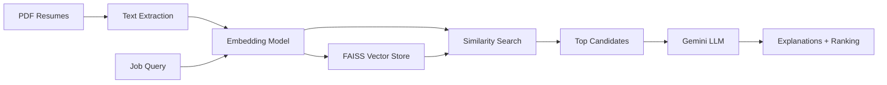

## What is RAG Recruitment Assistant?

The RAG Recruitment Assistant is an innovative **"Reverse Matching" system** built on Retrieval-Augmented Generation (RAG) architecture. Unlike traditional recruitment systems that filter candidates by years of experience, this system focuses on identifying talent based on:

<CardGroup cols={2}>
  <Card title="Technical Potential" icon="rocket">
    Evaluates candidates based on their skill stack, technical proficiency, and demonstrated abilities rather than tenure
  </Card>
  <Card title="Academic Projects" icon="graduation-cap">
    Values hands-on project experience, hackathon achievements, and academic work as key indicators of capability
  </Card>
  <Card title="Smart Matching" icon="brain">
    Uses AI to understand context and match candidates to roles based on semantic similarity, not keyword matching
  </Card>
  <Card title="Explainable Results" icon="lightbulb">
    Generates natural language justifications for why each candidate is a good fit
  </Card>
</CardGroup>

## The Reverse Matching Approach

Traditional recruitment systems filter candidates using rigid criteria like "5+ years of experience" or exact job title matches. The RAG Recruitment Assistant flips this paradigm:

<Note>
  **Reverse Matching** means the system doesn't ask "Does this candidate meet our requirements?" but instead asks "What valuable potential does this candidate have, and where would they excel?"
</Note>

This approach is especially valuable for identifying:
- Recent graduates with strong academic projects
- Career changers with transferable skills
- Self-taught developers with portfolio work
- Students seeking internships or entry-level positions

## RAG Architecture Overview

The system implements a complete RAG pipeline optimized for recruitment:

<Steps>
  <Step title="Document Ingestion">
    PDF resumes are loaded and parsed to extract text content, preserving structure and metadata
  </Step>
  
  <Step title="Vector Embedding">
    Text is converted into high-dimensional vectors using HuggingFace's sentence-transformers, capturing semantic meaning
  </Step>
  
  <Step title="Vector Indexing">
    FAISS (Facebook AI Similarity Search) creates an efficient index for fast similarity search across thousands of candidate profiles
  </Step>
  
  <Step title="Semantic Retrieval">
    When a job requirement is submitted, the system finds the most semantically similar candidate profiles
  </Step>
  
  <Step title="Context-Aware Generation">
    Retrieved candidate data is passed to Gemini 1.5 Flash LLM, which generates detailed explanations of why each candidate is suitable
  </Step>
</Steps>

### Architecture Diagram

## Technology Stack

The system is built with modern AI and ML tools:

<CardGroup cols={2}>
  <Card title="LangChain" icon="link">
    Framework for building LLM-powered applications with modular chains and retrievers
  </Card>
  <Card title="FAISS" icon="database">
    High-performance vector similarity search library from Meta AI Research
  </Card>
  <Card title="Gemini 1.5 Flash" icon="sparkles">
    Google's fast and efficient large language model for generating natural language explanations
  </Card>
  <Card title="HuggingFace Embeddings" icon="face-smile">
    Sentence transformers for creating semantic embeddings from text
  </Card>
</CardGroup>

**Supporting Libraries:**
- `sentence-transformers` - Neural network models for text embeddings
- `pypdf` - PDF document processing
- `pandas` - Data manipulation and analysis
- `plotly` - Interactive visualizations

## Target Audience and Use Cases

### Who Should Use This System?

<AccordionGroup>
  <Accordion title="University Career Services">
    Help match graduating students with internships and entry-level positions based on their academic projects, thesis work, and technical skills rather than non-existent work history.
  </Accordion>
  
  <Accordion title="Startup Talent Acquisition">
    Fast-growing companies that need to identify high-potential junior talent who can learn quickly, even if they lack traditional experience markers.
  </Accordion>
  
  <Accordion title="Technical Bootcamps & Training Programs">
    Organizations that want to demonstrate graduate outcomes by matching learners to opportunities based on portfolio projects.
  </Accordion>
  
  <Accordion title="HR Teams Focused on Diversity">
    Recruiters looking to reduce bias by evaluating candidates on demonstrated skills rather than pedigree or years of experience.
  </Accordion>
</AccordionGroup>

### Primary Use Cases

1. **Internship Placement** - Match students to internships based on academic projects and skill alignment
2. **Junior Role Screening** - Identify entry-level candidates with the right technical foundation
3. **Project-Based Evaluation** - Assess candidates by the complexity and relevance of their portfolio work
4. **Skills Gap Analysis** - Understand what technical capabilities candidates possess beyond their job titles

## Key Differentiators

<Warning>
  This system is **not** designed to replace human recruiters. Instead, it augments human decision-making by providing AI-powered insights and reducing initial screening time.
</Warning>

What makes this approach unique:

| Traditional Systems | RAG Recruitment Assistant |
|---------------------|---------------------------|
| Keyword matching | Semantic understanding |
| Years of experience filter | Project complexity evaluation |
| Binary yes/no screening | Ranked candidates with explanations |
| Opaque decision-making | Transparent AI reasoning |
| One-size-fits-all criteria | Context-aware matching |

## Project Context

This project was developed by **Anghelo Mendoza Prado** as a practical demonstration of applying Generative AI and RAG architecture to solve a real-world talent selection problem.

<Info>
  The system was originally developed and tested in **Google Colab**, making it accessible to anyone with a browser and a Google API key. It can also run locally with Python 3.10 or 3.11.
</Info>

## What's Next?

Ready to get started? Proceed to the [Quickstart](/quickstart) to run your first talent search, or jump to [Installation](/installation) if you want to set up a local environment.

<CardGroup cols={2}>
  <Card title="Quickstart" icon="bolt" href="/quickstart">
    Get up and running in 5 minutes with Google Colab
  </Card>
  <Card title="Installation" icon="download" href="/installation">
    Set up the system locally on your machine
  </Card>
</CardGroup>