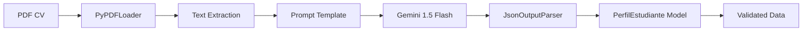

## Overview

The extraction schema defines how unstructured CV text is transformed into structured data using **LangChain's JsonOutputParser** with **Pydantic models**. This system combines prompt engineering, LLM reasoning, and schema validation to extract student profiles from PDF resumes.

<Note>
  The extraction schema is optimized for **student CVs** where traditional work experience is limited but academic projects and technical skills are rich.
</Note>

## Architecture



## JsonOutputParser Configuration

The parser bridges LangChain and Pydantic by generating format instructions that are injected into prompts.

### Setup Code

From `source/notebook/Talent_Scout_3000x.ipynb:921`:

```python
from langchain_core.output_parsers import JsonOutputParser
from pydantic import BaseModel, Field

# Define the schema (see PerfilEstudiante reference)
class PerfilEstudiante(BaseModel):
    nombre: str = Field(description="Nombre completo del estudiante")
    email: str = Field(description="Email universitario o personal")
    ubicacion: str = Field(description="Ciudad/País")
    universidad: str = Field(description="Nombre de la universidad o instituto")
    carrera: str = Field(description="Carrera que está estudiando (ej. Ing. Software)")
    ciclo_actual: str = Field(description="Ciclo o semestre actual (ej. 7mo Ciclo, Egresado)")
    stack_principal: list = Field(description="Lista de top 5 lenguajes/tecnologías que domina")
    proyectos_destacados: list = Field(description="Nombres de proyectos académicos, tesis o freelance mencionados")
    tipo_perfil: str = Field(description="Clasificar en: Backend, Frontend, Data, Fullstack o Gestión")
    potencial_contratacion: str = Field(description="Breve justificación de por qué contratarlo como practicante")

# Create parser instance
parser = JsonOutputParser(pydantic_object=PerfilEstudiante)
```

### Generated Format Instructions

The parser automatically generates JSON schema instructions:

```python
format_instructions = parser.get_format_instructions()
print(format_instructions)
```

**Output:**
```
The output should be formatted as a JSON instance that conforms to the JSON schema below.

As an example, for the schema {"properties": {"foo": {"title": "Foo", "description": "a list of strings", "type": "array", "items": {"type": "string"}}}, "required": ["foo"]}
the object {"foo": ["bar", "baz"]} is a well-formatted instance of the schema.

Here is the output schema:
{
  "properties": {
    "nombre": {"type": "string", "description": "Nombre completo del estudiante"},
    "email": {"type": "string", "description": "Email universitario o personal"},
    ...
  },
  "required": ["nombre", "email", "ubicacion", ...]
}
```

## Extraction Prompt Template

The prompt template combines domain expertise with extraction rules to guide the LLM.

### Full Template

From `source/notebook/Talent_Scout_3000x.ipynb:924-950`:

```python
from langchain_core.prompts import ChatPromptTemplate

template_estudiantes = """
Eres un Experto en Empleabilidad Joven y Reclutamiento IT.
Analiza el CV de este estudiante y extrae los datos estructurados.

UTILIZA EL SIGUIENTE FORMATO JSON:
{format_instructions}

REGLAS DE EXTRACCIÓN (Enfoque en Potencial):

1. ACADÉMICO:
   - Busca el ciclo actual (ej. "VI Ciclo", "7no", "Egresado"). Si no dice, infiérelo por las fechas.
   - Universidad: Extrae el nombre principal (ej. "UTP", "UPC", "San Marcos").

2. PROYECTOS (Clave para juniors):
   - Busca secciones como "Proyectos Académicos", "Freelance" o "Experiencia".
   - Extrae nombres de proyectos concretos (ej. "Sistema de Biblioteca", "App de Reciclaje").
   - NO pongas nombres de empresas genéricas, busca QUÉ HIZO.

3. TIPO DE PERFIL:
   - Analiza sus skills.
   - Si sabe Python + Pandas -> "Data".
   - Si sabe React + Node -> "Fullstack".
   - Si sabe Java + Spring -> "Backend".

TEXTO DEL CV:
{context}
"""

prompt_extract = ChatPromptTemplate.from_template(template_estudiantes)
```

### Prompt Design Principles

<AccordionGroup>
  <Accordion title="Role Assignment">
    **"Eres un Experto en Empleabilidad Joven y Reclutamiento IT"**
    
    Assigns the LLM an expert persona to improve reasoning quality. The model adopts the perspective of a recruiter focused on young talent.
  </Accordion>
  
  <Accordion title="Format Instructions Injection">
    **`{format_instructions}`** placeholder is replaced with the JSON schema at runtime, ensuring the LLM knows the exact output structure.
  </Accordion>
  
  <Accordion title="Domain-Specific Rules">
    **REGLAS DE EXTRACCIÓN** section provides heuristics for ambiguous cases:
    - How to infer academic cycle from dates
    - Focus on project names, not company names
    - Classification logic for profile types
  </Accordion>
  
  <Accordion title="Context Variable">
    **`{context}`** is filled with the CV text extracted from the PDF, providing the raw data for extraction.
  </Accordion>
</AccordionGroup>

## Extraction Chain

The chain combines prompt, LLM, and parser into a single invocable pipeline.

### Chain Construction

```python
from langchain_google_genai import ChatGoogleGenerativeAI

# Initialize LLM
llm = ChatGoogleGenerativeAI(
    model="gemini-1.5-flash",
    temperature=0  # Deterministic extraction
)

# Build chain: prompt → LLM → parser
chain_extract = prompt_extract | llm | parser
```

### Single CV Extraction

```python
from langchain_community.document_loaders import PyPDFLoader

# Load PDF
loader = PyPDFLoader("cv_estudiante.pdf")
pages = loader.load()
texto_completo = "\n".join([p.page_content for p in pages])

# Extract structured data
data = chain_extract.invoke({
    "context": texto_completo,
    "format_instructions": parser.get_format_instructions()
})

print(data['nombre'])  # "Fernanda Paredes"
print(data['tipo_perfil'])  # "Data"
```

## Batch Processing Example

Process multiple CVs with error handling and progress tracking.

### Full Implementation

From `source/notebook/Talent_Scout_3000x.ipynb:956-991`:

```python
import glob
import pandas as pd

resultados = []
archivos = glob.glob("cvs_estudiantes_final/*.pdf")

print(f"Analizando potencial de {len(archivos)} estudiantes con IA...")

for pdf in archivos:
    try:
        # Load PDF
        loader = PyPDFLoader(pdf)
        pages = loader.load()
        texto_completo = "\n".join([p.page_content for p in pages])

        # Extract with chain
        data = chain_extract.invoke({
            "context": texto_completo,
            "format_instructions": parser.get_format_instructions()
        })

        # Add metadata
        data['archivo_origen'] = pdf.split("/")[-1]
        resultados.append(data)

        print(f"Procesado: {data['nombre']} ({data['ciclo_actual']}) -> {data['tipo_perfil']}")

    except Exception as e:
        print(f"Error leyendo {pdf}: {e}")

# Convert to DataFrame
df_talent = pd.DataFrame(resultados)
display(df_talent[['nombre', 'universidad', 'ciclo_actual', 'tipo_perfil', 'stack_principal']])
```

**Console Output:**
```
Analizando potencial de 5 estudiantes con IA...
Procesado: FERNANDA PAREDES (9no Ciclo) -> Data
Procesado: XIMENA RIOS (9no ciclo) -> Fullstack
Procesado: NICOLAS PAREDES (7mo Ciclo) -> Fullstack
Procesado: LUCIANA CORDOVA (8vo ciclo) -> Fullstack
Procesado: FERNANDA MENDOZA (8vo Ciclo) -> Fullstack
```

## Input/Output Examples

### Example 1: Data Analyst Student

**Input CV Text (excerpt):**
```
FERNANDA PAREDES
Data Analyst Trainee
fernanda.student@universidad.edu.pe | +51 912 345 678 | Lima, Perú

PERFIL DE ESTUDIANTE
Estudiante de 9no ciclo con interés en Desarrollo de Software y Datos. 
Manejo de herramientas como Python y capacidad de aprendizaje rápido.

PROYECTOS Y EXPERIENCIA
Data Analyst Trainee | Proyecto Académico (UTP)
Jun 2025 - Feb 2026
• Primer puesto en Hackathon universitaria desarrollando app de reciclaje.
Tech: Python, PowerBI, Java, Spring Boot

FORMACIÓN ACADÉMICA
UTP - Ingeniería de Software (En curso)
```

**Extracted Output:**
```json
{
  "nombre": "FERNANDA PAREDES",
  "email": "fernanda.student@universidad.edu.pe",
  "ubicacion": "Lima, Perú",
  "universidad": "UTP",
  "carrera": "Ingeniería de Software",
  "ciclo_actual": "9no Ciclo",
  "stack_principal": ["Python", "PowerBI", "Java", "Spring Boot"],
  "proyectos_destacados": [
    "Primer puesto en Hackathon universitaria desarrollando app de reciclaje"
  ],
  "tipo_perfil": "Data",
  "potencial_contratacion": "Fernanda es una candidata fuerte para Data Analyst Trainee. Su victoria en Hackathon demuestra capacidad de ejecución bajo presión, y su stack (Python, PowerBI) es coherente con análisis de datos."
}
```

### Example 2: Fullstack Student

**Input CV Text (excerpt):**
```
XIMENA RIOS
Junior Python Developer
ximena.student@universidad.edu.pe | Lima, Perú

PERFIL DE ESTUDIANTE
Estudiante de 9no ciclo con interés en Desarrollo de Software y Datos.

PROYECTOS Y EXPERIENCIA
Junior Python Developer | Startup Universitaria
Mar 2025 - Feb 2026
• Creación de una API RESTful para gestión financiera usando Python y FastAPI.
Tech: Python, FastAPI, Java, React, Spring Boot

FORMACIÓN ACADÉMICA
San Marcos - Ingeniería de Software (En curso)
```

**Extracted Output:**
```json
{
  "nombre": "XIMENA RIOS",
  "email": "ximena.student@universidad.edu.pe",
  "ubicacion": "Lima, Perú",
  "universidad": "San Marcos",
  "carrera": "Ingeniería de Software",
  "ciclo_actual": "9no ciclo",
  "stack_principal": ["Python", "FastAPI", "Java", "React", "Spring Boot"],
  "proyectos_destacados": [
    "Creación de una API RESTful para gestión financiera usando Python y FastAPI"
  ],
  "tipo_perfil": "Fullstack",
  "potencial_contratacion": "Estudiante avanzado (9no ciclo) con experiencia práctica en la creación de APIs RESTful (FastAPI) y automatización de tareas (Python/Pandas). Su manejo de tecnologías tanto de Backend (Java, Spring Boot) como de Frontend (React) demuestra versatilidad técnica."
}
```

## Error Handling

### Common Issues

<Warning>
  **Validation Errors**: If the LLM returns data that doesn't match the schema, the parser will raise a validation error.
</Warning>

```python
try:
    data = chain_extract.invoke({
        "context": texto_completo,
        "format_instructions": parser.get_format_instructions()
    })
except Exception as e:
    print(f"Extraction failed: {e}")
    # Log the raw LLM output for debugging
    raw_output = llm.invoke(prompt_extract.format(
        context=texto_completo,
        format_instructions=parser.get_format_instructions()
    ))
    print(f"Raw LLM output: {raw_output}")
```

### Handling Missing Fields

If a field is truly missing from the CV, provide a default:

```python
# In the prompt, add a fallback rule
template_estudiantes = """
...
4. VALORES POR DEFECTO:
   - Si no encuentras el email, usa "no-disponible@example.com"
   - Si no hay proyectos mencionados, usa ["Sin proyectos destacados mencionados"]
...
"""
```

## Schema Format Instructions

The `parser.get_format_instructions()` method generates the JSON schema that tells the LLM how to structure its response.

### Generated Schema Structure

```json
{
  "properties": {
    "nombre": {
      "type": "string",
      "description": "Nombre completo del estudiante"
    },
    "email": {
      "type": "string",
      "description": "Email universitario o personal"
    },
    "ubicacion": {
      "type": "string",
      "description": "Ciudad/País"
    },
    "universidad": {
      "type": "string",
      "description": "Nombre de la universidad o instituto"
    },
    "carrera": {
      "type": "string",
      "description": "Carrera que está estudiando (ej. Ing. Software)"
    },
    "ciclo_actual": {
      "type": "string",
      "description": "Ciclo o semestre actual (ej. 7mo Ciclo, Egresado)"
    },
    "stack_principal": {
      "type": "array",
      "items": {"type": "string"},
      "description": "Lista de top 5 lenguajes/tecnologías que domina"
    },
    "proyectos_destacados": {
      "type": "array",
      "items": {"type": "string"},
      "description": "Nombres de proyectos académicos, tesis o freelance mencionados"
    },
    "tipo_perfil": {
      "type": "string",
      "description": "Clasificar en: Backend, Frontend, Data, Fullstack o Gestión"
    },
    "potencial_contratacion": {
      "type": "string",
      "description": "Breve justificación de por qué contratarlo como practicante"
    }
  },
  "required": [
    "nombre", "email", "ubicacion", "universidad", "carrera",
    "ciclo_actual", "stack_principal", "proyectos_destacados",
    "tipo_perfil", "potencial_contratacion"
  ]
}
```

## Performance Optimization

### Temperature Setting

```python
llm = ChatGoogleGenerativeAI(
    model="gemini-1.5-flash",
    temperature=0  # Deterministic for consistent extraction
)
```

<Tip>
  Use **temperature=0** for data extraction tasks to ensure consistent, deterministic outputs. Higher temperatures introduce randomness that can break schema validation.
</Tip>

### Parallel Processing

For large batches, use `asyncio` for parallel extraction:

```python
import asyncio
from langchain_core.runnables import RunnableParallel

async def extract_cv(pdf_path):
    loader = PyPDFLoader(pdf_path)
    pages = await loader.aload()
    texto = "\n".join([p.page_content for p in pages])
    
    return await chain_extract.ainvoke({
        "context": texto,
        "format_instructions": parser.get_format_instructions()
    })

# Process 10 CVs in parallel
results = await asyncio.gather(*[extract_cv(pdf) for pdf in archivos[:10]])
```

## Best Practices

<CardGroup cols={2}>
  <Card title="Validate Early" icon="check">
    Test your extraction prompt on 3-5 sample CVs before batch processing to catch edge cases.
  </Card>
  
  <Card title="Log Raw Outputs" icon="file-text">
    Save the LLM's raw text output before parsing to debug validation errors.
  </Card>
  
  <Card title="Use Enum Types" icon="list">
    For fields like `tipo_perfil`, consider using Pydantic's `Literal` type to enforce valid values at the schema level.
  </Card>
  
  <Card title="Monitor Costs" icon="dollar-sign">
    Track token usage with LangSmith or callbacks — batch processing can consume significant API quota.
  </Card>
</CardGroup>

## Advanced: Custom Validators

Add Pydantic validators for additional data quality checks:

```python
from pydantic import BaseModel, Field, validator

class PerfilEstudiante(BaseModel):
    # ... other fields ...
    
    stack_principal: list = Field(description="...")
    
    @validator('stack_principal')
    def validate_stack_length(cls, v):
        if len(v) > 5:
            return v[:5]  # Truncate to top 5
        if len(v) == 0:
            raise ValueError("stack_principal cannot be empty")
        return v
    
    @validator('ciclo_actual')
    def validate_ciclo_format(cls, v):
        if "ciclo" not in v.lower() and v != "Egresado":
            raise ValueError(f"Invalid ciclo format: {v}")
        return v
```

## Related Documentation

<CardGroup cols={2}>
  <Card title="PerfilEstudiante Model" icon="database" href="/reference/student-profile">
    Detailed field reference for the Pydantic model
  </Card>
  <Card title="Talent Mining Guide" icon="users" href="/guides/talent-mining">
    End-to-end workflow for batch CV processing
  </Card>
  <Card title="Profile Analysis" icon="magnifying-glass" href="/guides/profile-analysis">
    Query student profiles with semantic search
  </Card>
  <Card title="LLM Integration" icon="brain" href="/reference/llm-integration">
    Configure Gemini 1.5 Flash for optimal extraction
  </Card>
</CardGroup>